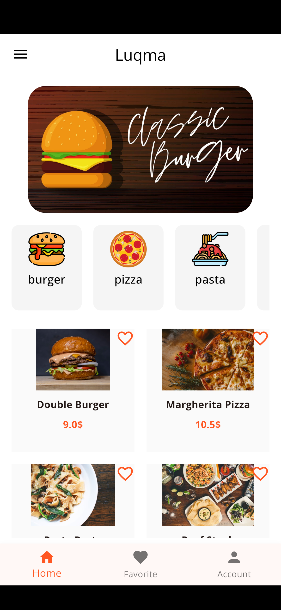
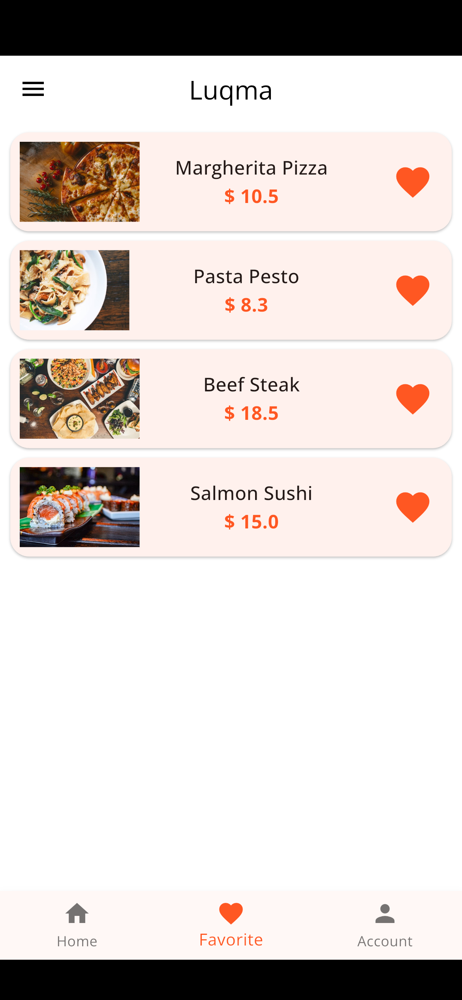
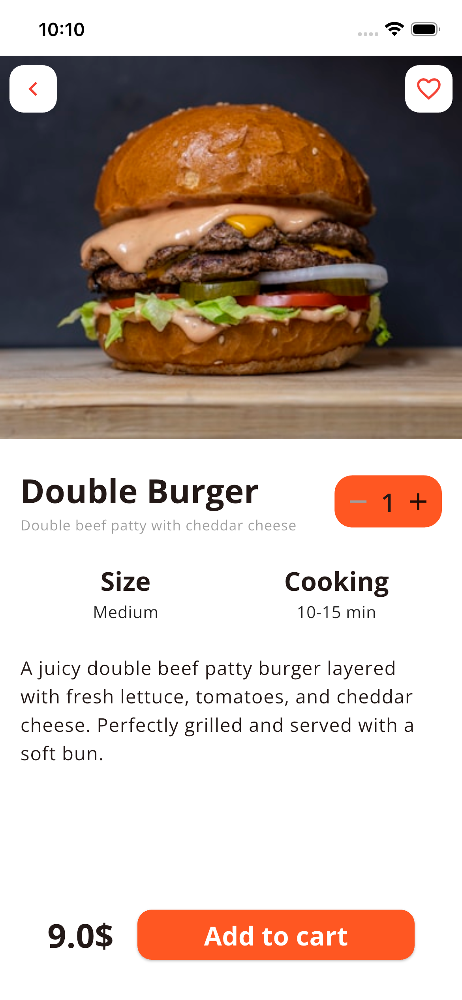
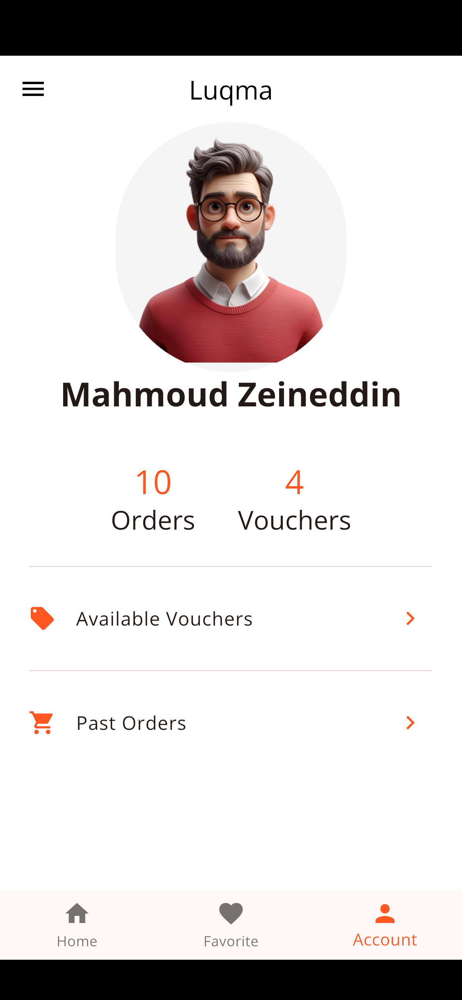

# 🍔 Luqma (لقمة) - Food Delivery App

### _The Journey of Engineering & Mastery_

## 📋 Overview

**Luqma** is not just a food delivery UI; it is a technical milestone representing a transition from basic Flutter concepts to deep architectural mastery. This project focuses on high-performance mobile experiences and robust data management solutions.

> [!IMPORTANT] > **Release v1.0.0 (Initial Logic & UI Mastery)**
> This is the first stable release focusing on core business logic, responsive architecture, and Flutter internals.

## ⏱️ Development Timeline

This project is the result of **45+ hours** of intensive, focused engineering, developed over **13 active days**. It represents a rigorous journey of mastering Flutter's deep internals and solving complex real-world logic challenges.

## 🖼️ App Interface (Visual Excellence)

<h3 align="center">Key Features in Action</h3>

  
  
  
  

## 🧠 Technical Mastery (Insights from 1.5 Months of Engineering)

### 1️⃣ Advanced Data Integrity (The Desync Solution)

- **Challenge:** Data mismatch between filtered categories and the main menu.
- **Mastery:** Refactored the architecture to use **Unique Object IDs** instead of list indexes. This ensured that 'Like' and 'Cart' operations remain 100% accurate even in highly dynamic filtered views.

### 2️⃣ Robust Logic & Edge Case Handling

- **Constraint Mastery:** Solved complex layout issues like "Expanded inside Column" by deeply understanding how constraints flow down and sizes go up.
- **Problem Solving:** Mastered the **VS Code Debugger** to trace variable states and resolve logical bottlenecks efficiently.

### 3️⃣ Performance & UI Internals (Course 5 Specialization)

- **Adaptive Design:** Leveraged `MediaQuery` for a pixel-perfect experience on both Android & iOS.
- **Advanced Scrolling:** Integrated `Slivers` (CustomScrollView) to provide the professional, smooth scrolling feel expected in top-tier applications.

### 4️⃣ Clean Code: Custom BuildContext Extensions

I implemented a custom **Extension** on `BuildContext` to eliminate boilerplate code and enhance maintainability:

- **Responsive Layouts:** Created `widthPct` and `heightPct` helpers using `MediaQuery.sizeOf(this)` for precise UI scaling.
- **Theme Access:** Simplified access to `textTheme` and `colorScheme` directly from the context.
- **Orientation Awareness:** Added an `isLandscape` getter to handle screen rotation seamlessly.

## 🚀 Future Roadmap (v2.0 & Beyond)

- [ ] Integration with **Firebase/Firestore** for real-time ordering and authentication.
- [ ] Implementing **BLoC Pattern** for enterprise-level state management.
- [ ] Adding a Local Database (Sqflite) for offline session persistence.

## 🛠️ Tech Stack

- **Framework:** Flutter (Mastered Course 4 & 5 internals).
- **State Management:** Logic-driven with unique ID mapping.
- **Development Tools:** VS Code (Advanced Debugging), Obsidian (Knowledge Base), GitHub.

---

_Developed with a commitment to growth, overcoming the "Perfectionism trap", and focused on delivering real-world value._
